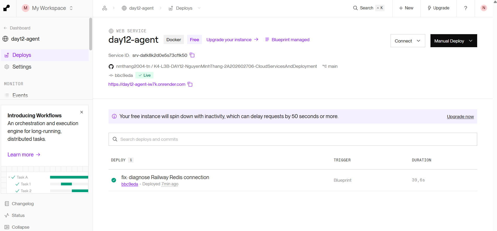
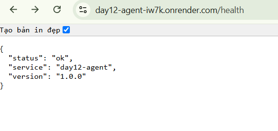
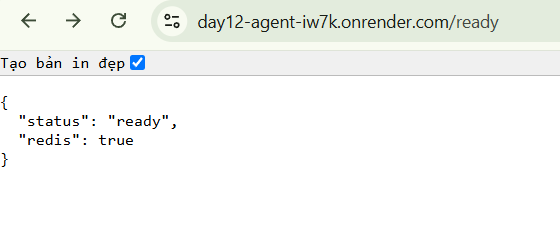

# Thông Tin Deploy — Checkpoint 5

## 1. Thông Tin Học Viên

| Mục | Nội dung |
|-----|----------|
| Họ và tên | Nguyễn Minh Thắng |
| Mã học viên | 2A202602706 |
| Repo | https://github.com/nmthang2004-th/K4-L3B-DAY12-NguyenMinhThang-2A202602706-CloudServicesAndDeployment |

## 2. Thông Tin Service

| Mục | Nội dung |
|-----|----------|
| Public URL | https://day12-agent-iw7k.onrender.com/ |
| Platform | Render |
| Deployment Method | Render Blueprint (`render.yaml`) |
| Application | FastAPI + Docker |
| Database | Render Key Value (Redis) |
| Ngày deploy | 29/09/2026 |
| Environment | Production |

Hệ thống được triển khai trên Render với hai thành phần chính:

- **Web Service:** Chạy FastAPI Agent từ Dockerfile.
- **Render Key Value:** Lưu lịch sử hội thoại, dữ liệu rate limiting và chi phí sử dụng theo tháng.

Ứng dụng kết nối Redis thông qua Internal Connection String, giúp dữ liệu được lưu bên ngoài process và có thể chia sẻ giữa các instance.

## 3. Biến Môi Trường Đã Set Trên Cloud

Chỉ ghi tên biến môi trường và nguồn cấu hình, không công khai giá trị secret.

| Biến | Đã set | Ghi chú |
|------|--------|---------|
| `PORT` | ✅ | Render tự cung cấp |
| `AGENT_API_KEY` | ✅ | Secret được cấu hình trong Render Dashboard |
| `REDIS_URL` | ✅ | Internal Connection String từ Render Key Value |
| `RATE_LIMIT_PER_MINUTE` | ✅ | 10 |
| `MONTHLY_BUDGET_USD` | ✅ | 10.0 |
| `LOG_LEVEL` | ✅ | INFO |

API key và thông tin xác thực Redis không được hard-code trong source code hoặc commit lên GitHub.

## 4. Lệnh Kiểm Tra

Public URL:

`https://day12-agent-iw7k.onrender.com`

### Test 1 — Liveness

```bash
curl -i https://day12-agent-iw7k.onrender.com/health
```

Kết quả mong đợi: HTTP 200.

```json
{
  "status": "ok",
  "service": "day12-agent",
  "version": "1.0.0"
}
```

### Test 2 — Readiness

```bash
curl -i https://day12-agent-iw7k.onrender.com/ready
```

Kết quả mong đợi: HTTP 200.

```json
{
  "status": "ready",
  "redis": true
}
```

### Test 3 — Authentication (Không có API Key)

```bash
curl -i -X POST https://day12-agent-iw7k.onrender.com/ask \
  -H "Content-Type: application/json" \
  -d '{"question":"Hello"}'
```

Kết quả mong đợi: HTTP 401.

```json
{
  "detail": "invalid or missing API key"
}
```

### Test 4 — Authentication (API Key hợp lệ)

```bash
curl -i -X POST https://day12-agent-iw7k.onrender.com/ask \
  -H "Content-Type: application/json" \
  -H "X-API-Key: $AGENT_API_KEY" \
  -H "X-User-Id: sv-test" \
  -d '{"question":"Deploy là gì?"}'
```

Kết quả mong đợi: HTTP 200, trả về câu trả lời của Agent cùng thông tin user, token và chi phí.

### Test 5 — Rate Limiting

```bash
for i in $(seq 1 15); do
  curl -s -o /dev/null -w "%{http_code} " \
    -X POST https://day12-agent-iw7k.onrender.com/ask \
    -H "Content-Type: application/json" \
    -H "X-API-Key: $AGENT_API_KEY" \
    -H "X-User-Id: sv-test" \
    -d '{"question":"test"}'
done; echo
```

Với giới hạn 10 request/phút, các request vượt quota trong cùng cửa sổ 60 giây phải trả HTTP 429.

## 5. Kết Quả Chạy Thật

Điền output thực tế của các lệnh kiểm tra ở trên:

```text
Test 1 - /health:
[Điền HTTP status và response thực tế]

Test 2 - /ready:
[Điền HTTP status và response thực tế]

Test 3 - /ask without API key:
[Điền HTTP status và response thực tế]

Test 4 - /ask with valid API key:
[Điền HTTP status và response thực tế, không hiển thị secret]

Test 5 - Rate limiting:
[Điền chuỗi HTTP status thực tế]
```

## 6. Ảnh Chụp Màn Hình

Các hình ảnh minh chứng được lưu tại thư mục `screenshots/`.

### Render Dashboard



### Health Endpoint



### Readiness Endpoint (Minh chứng bổ sung)



## 7. Tổng Kết

Dự án sử dụng Render Blueprint để triển khai FastAPI Agent và Render Key Value.

Hệ thống áp dụng các nội dung đã hoàn thành từ CP1 đến CP4:

- 12-Factor Configuration và Structured Logging.
- Multi-stage Docker Build và Non-root Container.
- API Key Authentication, Rate Limiting và Cost Guard.
- Redis Conversation Store, Liveness, Readiness và Graceful Shutdown.

Việc nghiệm thu CP5 được xác nhận thông qua Public URL, kết quả kiểm thử thực tế, ảnh minh chứng và checkpoint `tests/test_cp5.py`.

**Platform:** Render.

**Local Fallback:** Không sử dụng.